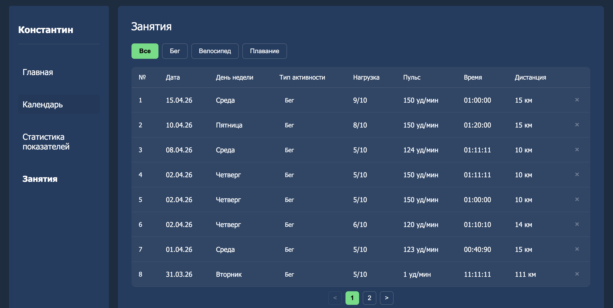
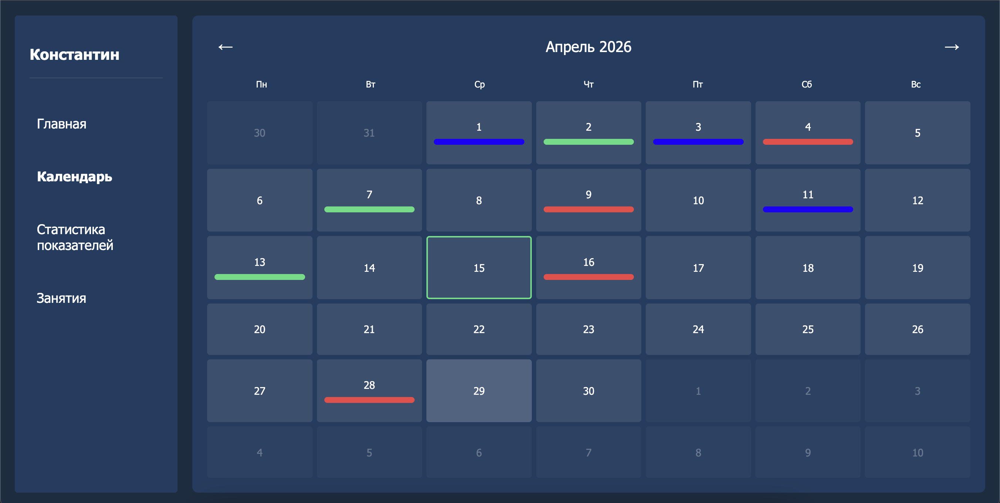

# 🏋️ Tracker

Интерактивное веб-приложение для отслеживания тренировок, целей и прогресса пользователя.

Основной фокус:
- архитектура frontend-приложения  
- управление состоянием  
- работа с TypeScript  
- разделение логики и UI  

---

## 🌐 Live Demo

https://tracker-puce-alpha.vercel.app/

---

## 📸 Screenshots

### 🏠 Главная страница

<p>Основной экран приложения с отображением активности пользователя и навигацией по разделам.</p>


### 🏋️ Тренировки

<p>Список заверщенных тренировок с фильтрацией и пагинацией</p>

### 📅 Календарь

<p>Планирование тренировок на месяц</p>

### 📈 Статистика

<p>Аналитика тренировок и визуализация прогресса пользователя.</p>

---

## ✨ Key Features & Value

- 🧠 **Feature-based архитектура**  
  Проект разделён по бизнес-доменам (training, goals, calendar, statistics), что упрощает масштабирование и поддержку.

- 📦 **Глобальное состояние через Context API**  
  Состояние разделено на несколько контекстов (тренировки, цели, пользователь), что уменьшает связанность и избавляет от prop drilling.

- 💾 **Сохранение данных (localStorage)**  
  Все пользовательские данные сохраняются между сессиями без необходимости backend.

- 🧮 **Вынос бизнес-логики**  
  Основные расчёты и логика вынесены в utils, что повышает переиспользуемость и упрощает тестирование.

- ⚡ **Быстрая работа приложения**  
  Использование современного стека обеспечивает быстрый рендер и отзывчивый UI.

---

## 🧩 Technical Decisions & Challenges

- **Почему Context API:**  
  Выбран как лёгкое решение для управления глобальным состоянием без усложнения архитектуры. При масштабировании планируется переход на Zustand или Redux Toolkit.

- **Хранение данных в localStorage:**  
  Использовано как простое решение для persistence. Архитектура позволяет легко заменить на backend.

- **Выбор структуры проекта:**  
  Feature-based подход позволяет изолировать бизнес-логику и UI, упрощая развитие проекта.

- **Работа с данными:**  
  Изначально использовалась структура Map, но в дальнейшем планируется переход на более простые структуры (Record) для лучшей сериализации.

- **Основной вызов:**  
  Управление состоянием и синхронизация данных между компонентами без использования сторонних библиотек.

---

## 🛠 Tech Stack

- React
- TypeScript
- Context API
- LocalStorage
- Vite

---

## 🧠 Architecture

Проект организован по feature-based подходу:

- features/ — бизнес-домены (training, goals, calendar, statistics)
- shared/components/ — переиспользуемые UI-компоненты
- shared/utils/ — бизнес-логика и расчёты
- shared/types/ — типы данных
- context/ — глобальное состояние приложения

Подход позволяет:
- разделять ответственность
- переиспользовать код
- упрощать масштабирование

---

## ⚙️ Installation

```bash
git clone https://github.com/taro4kaaaaa/Tracker.git
cd Tracker
npm install
npm run dev
```

---

